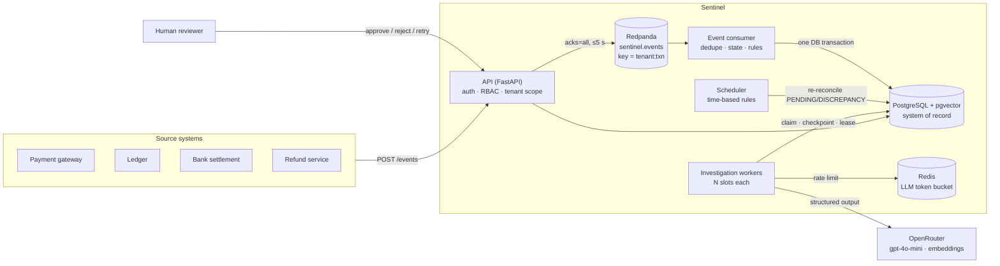

# Architecture

## Components



| Component | Process | Scales by | State it owns |
|---|---|---|---|
| API | `uvicorn sentinel.api.main:app` | replicas (stateless) | none: reads PostgreSQL, writes to Kafka |
| Event consumer | `python -m sentinel.workers.event_consumer` | Kafka partitions (one consumer per partition in the group) | Kafka offsets |
| Scheduler | `python -m sentinel.workers.scheduler` | per-transaction advisory lock, so extra replicas are safe | none |
| Investigation worker | `python -m sentinel.workers.investigation_worker` | replicas × `SENTINEL_WORKER_CONCURRENCY` | leases on investigations |
| PostgreSQL 16 + pgvector | | vertical; read replicas for the API | everything durable |
| Redpanda (Kafka API) | | partitions | the event log |
| Redis | | | the shared LLM token bucket only (safe to lose) |

Each Python process is the same image with a different command, so compose and
Kubernetes ([`deploy/k8s`](../deploy/k8s)) run the same artifact.

## Event path

1. **`POST /events`** (SERVICE role) validates the event with Pydantic.
   - Unknown fields are rejected, and amount and currency must come together.
   - The tenant is checked against the API key.
   - The event is produced to `sentinel.events` with key `tenant_id:transaction_id`,
     so all events of a transaction land on one partition, in order.
   - The API returns **202 only after the broker acknowledged** (`acks=all`). If it
     can't within 5 s it returns **503**, and the client retries. The API never holds
     an event only in memory.
2. **The event consumer** handles each message in **one PostgreSQL transaction**:
   - insert the event (`UNIQUE (tenant_id, event_id)`; a duplicate is a no-op);
   - rebuild the transaction's state from *all* its events (order-independent reducer);
   - run the reconciliation rules;
   - open or resolve findings, open investigations, and write audit rows.

   **After** that commit, it commits the Kafka offset. A crash in between causes
   redelivery, and the unique key absorbs it. Delivery is at-least-once; processing is
   effectively once.
3. **The scheduler** re-reconciles `PENDING` and `DISCREPANCY` transactions every
   `SENTINEL_SCHEDULER_INTERVAL_SECONDS`. Time-based rules (missing ledger, missing
   settlement) can fire without a new event. Each transaction is locked with
   `pg_advisory_xact_lock`, so the scheduler and consumer never reconcile it
   concurrently.
4. **Unprocessable messages go to a dead letter.** Examples: invalid JSON, a schema
   violation, a DB constraint violation. The message goes to `dead_letters` (visible via
   `GET /dead-letters`, ADMIN) and its offset is committed, so one bad message never
   blocks a partition.

## Reconciliation

Rules are small classes registered with `@register` in
[`reconciliation/rules`](../src/sentinel/reconciliation/rules) and discovered
automatically. Each is a pure function of the transaction's state and a context
holding the clock and thresholds.

| Rule | Fires when |
|---|---|
| `MISSING_LEDGER` | captured, no ledger posting after the grace period (measured from **arrival**) |
| `LEDGER_MISMATCH` | ledger amount ≠ captured amount, or a ledger posting for a failed payment |
| `SETTLEMENT_MISMATCH` | settled amount ≠ captured amount |
| `DUPLICATE_CAPTURE` | more than one capture |
| `MISSING_SETTLEMENT` | no settlement 24 h after capture |
| `REFUND_MISMATCH` | internal refund without matching gateway confirmation (after grace) |

- A finding is a row in `reconciliation_results`, keyed by tenant, transaction and
  anomaly type.
- It is `OPEN` while the rule fires and becomes `RESOLVED` when later events fix the
  data. Its investigation is then closed as `AUTO_RESOLVED`.
- A transaction is `DISCREPANCY` iff it has an open finding, `MATCHED` when complete and
  clean, and `PENDING` otherwise.

## Investigation workflow

At most one active investigation exists per (tenant, transaction, anomaly). This is a
partial unique index `WHERE closed_at IS NULL`, and creation uses
`INSERT … ON CONFLICT DO NOTHING`. Priority comes from the anomaly type, severity and
amount (a duplicate capture, or ≥ 100,000, is CRITICAL).

```
STARTED → TRANSACTION_DATA_COLLECTED → RELATED_EVENTS_COLLECTED → KNOWLEDGE_RETRIEVED
        → AI_ANALYSIS_COMPLETED → RESULT_VERIFIED → COMPLETED  (status AWAITING_REVIEW)
```

- **Claim.** `SELECT … FOR UPDATE SKIP LOCKED`, most urgent first. The claim takes a
  **lease** (owner and expiry), extended by a heartbeat.
- **Checkpoint.** Each step's output is committed to `investigation_steps` (unique per
  step), together with a lease check. A worker that lost its lease writes nothing.
  Re-running a completed step is impossible, so the LLM is never called twice for a
  checkpointed analysis.
- **Crash.** The heartbeat stops and the lease expires. Any worker re-claims the
  investigation and resumes after the last checkpoint.
- **SIGTERM.** The step in flight finishes and is checkpointed, and the lease is
  released for immediate pickup.
- **Failure.** Exponential backoff with jitter (`next_attempt_at`). After
  `SENTINEL_MAX_ATTEMPTS` the investigation goes to `FAILED` plus a dead letter. A human
  can `retry`.
- **Review.** `approve`, `reject` and `retry` are each one conditional `UPDATE`, so
  concurrent reviewers get one winner and one **409**.

## AI analysis

1. **Retrieval.** A hybrid search over the knowledge base: pgvector HNSW cosine plus
   PostgreSQL full-text, fused with reciprocal rank fusion. It is **always filtered to
   the caller's tenant plus global documents**, and optionally by gateway.
2. **Injection screening.** Chunks that look like instructions are **quarantined**:
   recorded in the checkpoint, never shown to the model.
3. **Model call.** OpenRouter, with a strict JSON-schema structured output:
   - the classification must come from a fixed list;
   - each fact's `source` is an enum of the event ids, chunk ids, `finding` and
     `transaction` actually supplied.

   Invalid output gets one repair round. A shared Redis token bucket caps requests per
   second across all workers; if Redis is down, each process falls back to a local
   bucket.
4. **Grounding.** A fact survives only if its source exists and every number in it
   appears in that source or in the authoritative data. The rest are demoted to
   "Unverified" hypotheses. Confidence is capped by the supported share, and
   `requires_human_review` is forced true.

The model has **no tools and no write access**. Its only output is a report that a human
approves or rejects. Financial state is only ever computed by the deterministic rules.

## Data model (PostgreSQL)

| Table | Purpose |
|---|---|
| `tenants`, `users` | tenants; API-key users (SHA-256 hash, role, tenant) |
| `events` | raw events, `UNIQUE (tenant_id, event_id)` |
| `transactions` | materialized state per (tenant, transaction) |
| `reconciliation_results` | findings (OPEN / RESOLVED), one per (tenant, txn, anomaly) |
| `investigations` | workflow state, lease, attempts, errors, final report, review |
| `investigation_steps` | one checkpoint per step, `UNIQUE (investigation_id, step)` |
| `documents`, `document_chunks` | knowledge base; chunks with `vector(1536)`, `tsvector`, tenant, gateway |
| `audit_logs` | append-only trail of every state change, per tenant |
| `dead_letters` | unprocessable events and exhausted investigations |

Every tenant-owned table carries `tenant_id`, and every query filters by the tenant
taken from the API key. Migrations: [`db/migrations`](../src/sentinel/db/migrations)
(Alembic, run by the `migrate` job before any service starts).

## Observability

- **Logs.** Structured JSON logs with context: `request_id`, `tenant_id`,
  `transaction_id`, `event_id`, `investigation_id`, `worker_id`. The `request_id`
  travels from the API through a Kafka header into the consumer.
- **Metrics.** Prometheus metrics on the API at `/metrics` and on each worker at
  `:9100`, covering all 11 the spec requires.
- **Audit.** Every state change is also written to `audit_logs`, readable per tenant
  via `GET /audit-logs`.

See also: [failure-model.md](failure-model.md), [security.md](security.md),
[decisions.md](decisions.md).
